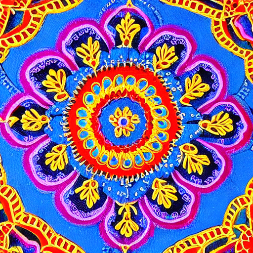
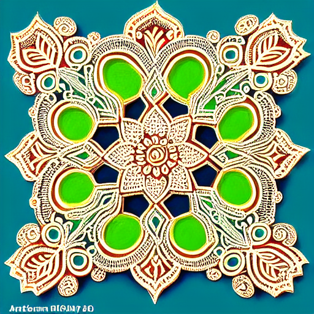

# Kolam AI Generator

A beautiful web interface for generating intricate Kolam patterns using AI. This application combines the power of Stable Diffusion with a modern, responsive React frontend to create stunning traditional South Indian art.


## Demo Video

https://github.com/user-attachments/assets/45f25480-881f-487a-ab9e-d969d452ed11


## Features

- **Beautiful Modern UI**: Clean, responsive design with glassmorphism effects
- **AI-Powered Generation**: Uses Stable Diffusion to create detailed Kolam patterns
- **Smart Prompting**: Base prompt always includes "a highly detailed SKS kolam, intricate symmetrical pattern, masterpiece, sharp focus"
- **Quick Presets**: Pre-defined prompt suggestions for common Kolam styles
- **Advanced Settings**: Customizable parameters (steps, CFG scale, sampler, etc.)
- **Image History**: View and download your recent generations
- **Download Support**: Save your generated Kolams as PNG files
- **Responsive Design**: Works perfectly on desktop, tablet, and mobile

## Gallery
| | |
|:-------------------------:|:-------------------------:|
|  |  |
|  |  |
## Quick Start

### Prerequisites

1. **Python 3.10+** (Required for Stable Diffusion WebUI)
2. **Node.js 16+** and npm (Required for Frontend)
3. **Git**

### Installation & Setup

**IMPORTANT**: This repository does **NOT** contain the Stable Diffusion WebUI. You must clone it separately and configure it as described below.

#### 1. Setup Stable Diffusion WebUI (DirectML)

1.  **Clone the WebUI Repository**:
    Open a terminal in a *separate* folder (or same parent folder) and run:
    ```bash
    git clone https://github.com/lshqqytiger/stable-diffusion-webui-directml.git
    cd stable-diffusion-webui-directml
    ```

2.  **Download the Base Model**:
    - Download **Stable Diffusion v1.5** (`v1-5-pruned-emaonly.safetensors`).
    - [Download Link (HuggingFace)](https://huggingface.co/runwayml/stable-diffusion-v1-5/resolve/main/v1-5-pruned-emaonly.safetensors)
    - **PASTE HERE**: `stable-diffusion-webui-directml/models/Stable-diffusion/`

3.  **Install the Kolam LoRA**:
    - This `kolam-image-gen` repository contains the custom trained LoRA model file: `kolam_lora_final.pth`.
    - **Step A**: Locate `kolam_lora_final.pth` in the root of *this* project.
    - **Step B**: **COPY** it.
    - **Step C**: **PASTE** it into the WebUI folder: `stable-diffusion-webui-directml/models/Lora/`

4.  **Run the WebUI**:
    - Open a terminal in the `stable-diffusion-webui-directml` folder.
    - Run the following command (YOU MUST INCLUDE --api):
      ```bash
      ./webui-user.bat --api --listen
      ```
    - Wait until it says "Running on local URL: http://127.0.0.1:7860".

#### 2. Setup Kolam Image Gen (This App)

1.  **Install Python Backend Dependencies**:
    ```bash
    pip install -r requirements.txt
    ```

2.  **Install Frontend Dependencies**:
    ```bash
    cd sd-frontend
    npm install
    cd ..
    ```

### Running the Application

Once the Stable Diffusion WebUI is **running** on port 7860:

#### Option 1: One-Click Start (Recommended)
Run the startup script from the root of this repo:
```bash
python start_server.py
```

#### Option 2: Manual Start

1.  **Start Backend** (New Terminal in `kolam-image-gen`):
    ```bash
    python -m uvicorn app:app --host 0.0.0.0 --port 8000 --reload
    ```

2.  **Start Frontend** (New Terminal in `kolam-image-gen/sd-frontend`):
    ```bash
    cd sd-frontend
    npm start
    ```

3.  **Access the App**:
    - Open http://localhost:3000 in your browser.

## Dataset

The training data for this model is available publicly.
**Dataset Name**: **[Traditional Kolam Geometric Patterns Dataset](https://www.kaggle.com/datasets/preygle/traditional-kolam-geometric-patterns-dataset)**

## How to Use

1. **Enter your prompt**: Add additional details to the base Kolam prompt (optional)
2. **Use presets**: Click on quick preset buttons for common styles
3. **Adjust settings**: Expand "Advanced Settings" to customize generation parameters
4. **Generate**: Click "Generate Kolam" to create your artwork
5. **Download**: Hover over generated images and click the download button

## Configuration

### Backend (`app.py`)
- **API Endpoint**: Connects to `http://127.0.0.1:7860/sdapi/v1/txt2img`
- **Port**: Runs on `8000`

### Frontend (`sd-frontend/src/App.js`)
- **API Endpoint**: Connects to `http://localhost:8000/generate`
- **Port**: Runs on `3000`

## Project Structure

```text
kolam-image-gen/
├── app.py                      # Main FastAPI backend server that handles image generation requests
├── start_server.py             # Utility script to launch both backend and provide frontend instructions
├── test_sd_api.py              # Diagnostic script to verify connectivity with Stable Diffusion WebUI
├── kolam_lora_final.pth        # Custom trained LoRA model for Kolam patterns
├── requirements.txt            # Python dependencies
├── sd-frontend/                # React frontend application directory
├── auto_crop_borders.py        # Preprocessing: Removes whitespace borders from images
├── preprocess_dataset.py       # Preprocessing: Resizes and cleans dataset images
├── invert_image_colors.py      # Preprocessing: Inverts image colors (black/white conversion)
├── validate_dataset.py         # Utility: Checks dataset image dimensions and formats
├── extract_individual_kolams.py # Processing: Segments multiple Kolams from a single sheet
├── pinterest_scraper.py        # Data Collection: Scrapes Kolam images for training data
├── sanitize_filenames.py       # Utility: Standardizes filenames in the dataset
├── dcgan.py                    # Experimental: DCGAN implementation for pattern generation
├── lora_train.py               # Training: Script used for LoRA model training
├── output/                     # Directory where generated images are saved
└── README.md                   # Project documentation
```

## License

This project is open source and available under the MIT License.
